# 架构设计

## 主流程

```mermaid
flowchart LR
  A["OKX Market Data"] --> B["Data Validator"]
  B --> C["Feature Engine"]
  C --> D["Strategy"]
  D --> E["TradeIntent"]
  E --> F["Risk Engine"]
  F --> G["OMS"]
  G --> H["OKX Broker Adapter"]
  H --> I["Order / Fill Events"]
  I --> J["Ledger"]
  J --> K["Reconciliation"]
  K --> L["Reports / Alerts"]
```



## 模块边界

`Strategy`

只计算信号和目标仓位，不知道 OKX 的签名、字段和订单接口。

`Risk`

在下单前做硬闸门：金额、暴露、价差、行情新鲜度、日亏损、订单频率、kill switch。

`OMS`

维护本地订单状态机，负责 `clOrdId` 幂等、部分成交、撤单、未知状态和重启恢复。

`BrokerAdapter`

封装 OKX REST/WebSocket 细节，包括签名、模拟盘 header、订单频道和交易所查询。

`Ledger`

记录订单、成交、手续费、余额变化和账户快照。

`Reconciliation`

用 OKX 订单、成交、账单流水校验本地状态。对账失败时禁止新单。

## 状态机

```text
Created
  -> Submitted
  -> Accepted
  -> PartiallyFilled
  -> Filled

Submitted -> Rejected
Accepted -> CancelPending -> Cancelled
PartiallyFilled -> CancelPending -> Cancelled
Any active state -> Unknown
Unknown -> Accepted / PartiallyFilled / Filled / Cancelled / Rejected
```

## 配置隔离

`demo` 和 `live` 必须使用不同 `.env` 文件。实盘必须显式设置：

```text
OKX_ENV=live
OKX_SIMULATED_TRADING=0
READ_ONLY_MODE=0
KILL_SWITCH=0
```

